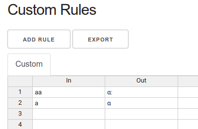
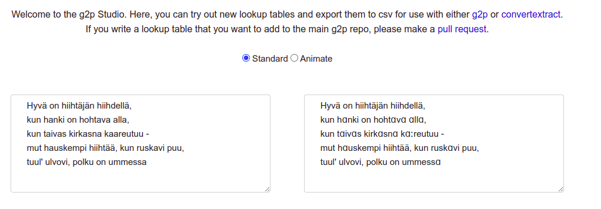

Making a read-along, from A to Ö
================================

I decided to walk through the entire process of making a full
read-along, with text, audio, and images, as a language learner for an
as-yet unsupported language with a very straightforward writing
system.

I will make a read-along of the poem "Hyvä on hiihtäjän hiihdellä" by
Eino Leino. which can be found online at
[WikiSource](https://fi.wikisource.org/wiki/Hyv%C3%A4_on_hiiht%C3%A4j%C3%A4n_hiihdell%C3%A4):

    Hyvä on hiihtäjän hiihdellä,
    kun hanki on hohtava alla,
    kun taivas kirkasna kaareutuu -
    mut hauskempi hiihtää, kun ruskavi puu,
    tuul' ulvovi, polku on ummessa
    ja tuisku on taivahalla.

    Hyvä on hiihtäjän hiihdellä,
    kun ystävä häll' on myötä,
    kun latu on aukaistu edessään -
    mut parempi hiihdellä yksinään,
    tiens' itse aukaista itselleen
    ja yksin uhmata yötä.

    Hyvä on hiihtäjän hiihdellä,
    kun tietty on matkan määrä,
    kun liesi viittovi lämpöinen, -
    mut sorjempi, uljaampi hiihtää sen,
    joka outoja onnen vaiheita käy
    eikä tiedä, miss' oikea, väärä.

    Ja hyvä on hiihtäjän hiihdellä,
    kun riemu on rinnassansa,
    kun toivo säihkyvi soihtuna yöss' -
    mut käypä se laatuun hiihtää myös
    hiki otsalla, suurissa suruissa
    ja kuolema kupeellansa.

This is, of course, in Finnish, which I have been learning very
slowly, and do not speak well, but hopefully well enough to make a
read-along!

The first step, clearly, is to record myself speaking the text.  We
don't have an interface to do this in the ReadAlong Studio web
application, but in some sense this is okay, because I know I won't
get it right on the first try, so it may be useful to do some
post-editing.  I chose to use
[Audacity](https://www.audacityteam.org/) since it's free and I'm more
or less familiar with it.

I opened up Audacity, and set the [Project
Rate](https://manual.audacityteam.org/man/selection_toolbar.html) to
22050 Hz, since anything greater is a waste for voice data, and the
[Recording
Channels](https://manual.audacityteam.org/man/device_toolbar.html) to
1 (mono).  But don't worry too much about this, it isn't strictly
necessary as ReadAlong Studio will accept a wide range of inputs.

I then pressed "record", spoke the poem, pressed "stop", then selected
"Export..." from the File menu to save the track as the WAV file [hyvä
on hiihtäjän hiihdellä.wav](./hyvä%20on%20hiihtäjän%20hiihdellä.wav).  It
took a few tries to get  it all in one take, and it's far from perfect,
but it ought to align without any problems.

Next, we have to add the writing system, which, as mentioned earlier,
is really simple.  There are only a few minor complexities in mapping
literary Finnish to IPA (the International Phonetic Alphabet), and we
will simply ignore most of them for the purposes of alignment - my
pronunciation is far from correct in any case!  I followed the
instructions on [Aidan's
blog](https://blog.mothertongues.org/g2p-basic-mappings-gui/) to write
them in G2P studio.  Unfortunately, while I would have liked to paste
the entire poem into the text area for testing, it only accepts a few
lines at a time.

In order to enter the IPA characters for the rules, you can use
[typeit.org](https://ipa.typeit.org/full/).  One thing you have to
watch out for is that the "long" character in IPA, which looks like a
colon, is actually *not* a colon but a specific character, so make
sure that you either use the IPA keyboard or copy from a known good
IPA text.

Even worse, the "g" in ASCII is not the same as the /ɡ/ in IPA.  Copy
that one from this document if you are confused.

Although it's not strictly necessary to add rules for letters which
are the same in Finnish as in IPA (basically all the consonants), it's
useful to enter the entire alphabet, which you can find in convenient
table form on
[Wikipedia](https://en.wikipedia.org/wiki/Finnish_orthography).  So,
let's start at the beginning with the letter `a`.  As mentioned
earlier, IPA has a "long" symbol, so we want to map the long vowel
`aa` to `ɑː` and the short vowel `a` to `ɑ`.  Let's enter those into
the "Custom Rules" table: 

Already you can see that some of the letters have been converted in
the output: 

Nearly all of the rules invole simply mapping long vowels to the IPA
representation with the length marker.  We will also add a couple
rules for assimilation of /n/ as noted on [the Wikpedia page on
Finnish phonology](https://en.wikipedia.org/wiki/Finnish_phonology) -
we can test these with the examples mentioned there, such as
"menenpä", which we can see maps to /menempæ/.

Clicking on "export" downloaded the file `rules.csv`.  I created the
directory `g2p/mappings/langs/fin` in my local copy of the `g2p`
source, then copied `rules.csv` to `fin_to_ipa.csv` in that directory,
and created a `config.yaml` to point to it:

```
<<: &shared
  - language_name: Finnish
mappings:
  - display_name: Finnish to IPA
    in_lang: fin
    out_lang: fin-ipa
    authors:
      - David Huggins-Daines
    type: mapping
    mapping: fin_to_ipa.csv
    rule_ordering: as-written
    case_sensitive: false
    norm_form: 'NFC'
    <<: *shared
```

To test this, I ran `g2p convert` from that directory:

```
$ g2p convert "hiihtää" fin fin-ipa --config config.yaml 
hiːhtæː
```

Seems to work!  I then needed to update the g2p library to include the
new mappings.  To do this, I made sure g2p is installed "writeable":


```
pip install -e .
```

And updated the mappings:

```
$ g2p update
INFO - Server initialized for eventlet.
INFO - Updated API documentation
INFO - Wrote network nodes and edges to static file.
$ g2p generate-mapping fin --ipa
INFO - Server initialized for eventlet.
Writing English IPA mapping for fin-ipa to file
100%|████████████████████████████████████████████████████████████████████████████████▉| 99.99999999999996/100 [00:00<00:00, 730.27it/s]
WARNING - Adding mapping config to file at /home/dhd/work/g2p/g2p/mappings/langs/generated/config.yaml
```

Note that the documentation on the MotherTongues blog seems to be out
of date, as the somewhat cryptic "&shared" and "*shared" are required
in `config.yaml` for this to work.  Also, as noted above, the IPA
characters *must* be valid IPA, /ɡ/ in particular, or the mappings
will not be created.

I then checked to make sure the changes are there by running `g2p
convert` for both the basic mapping and the `eng-arpabet` one I'll
ultimately use in g2p studio:

```
$ g2p convert "hiihtää" fin fin-ipa
hiːhtæː
$ g2p convert "hiihtää" fin eng-arpabet
HH EY HH T EY 
```

Hmm, that doesn't look right, exactly, as "ä" really should get
mapped to "AE" in ArpaBet, but it seems that the phonetic matching
decided that a *long* one was a better fit to "EY".  If we try the
short vowel, we see something else:

```
$ g2p convert "ei hiihdä" fin eng-arpabet
EH IY  HH EY HH D AE 
```

Well, it's not at all correct, but it should align anyway.  Really I
ought to add specific rules for diphthongs, of which there are many.

At this point, I have everything I need to try aligning, so I'll do
that!  I can put the text of the poem, as shown above, into the file
[hyvä on hiihtäjän hiihdellä.txt](./hyvä%20on%20hiihtäjän%20hiihdellä.txt).
ReadAlong Studio uses two blank lines to separate pages, so I added an
extra line between each stanza.  Then I ran `readalongs align` with
`--save-temps` to keep debugging information around just in case:

```
$ readalongs align --save-temps -o html -l fin hyvä\ on\ hiihtäjän\ hiihdellä.txt hyvä\ on\ hiihtäjän\ hiihdellä.wav output
INFO - Words (<w>) not present; tokenizing
INFO - Align mode strict succeeded for sequence 0.
INFO - Number of words found: 109
INFO - Number of aligned segments: 109
```

But lo and behold, it succeeded!  And I can open up
`output/output.html` and follow along my awful pronunciation in
real-time...

Now, I would like to add some pictures.  The poem is about
cross-country skiing, and I have lots of photos of that, so I will
pick a few of them and put one on each page.  Images can be added by
creating a `config.json` file, so I've done that, in this directory:

```
{
    "images": {
        "0": "0.jpg",
        "1": "1.jpg",
        "2": "2.jpg",
        "3": "3.jpg"
    },
    "title": "Hyvä on hiihtäjän hiihdellä",
    "header": "Hyvä on hiihtäjän hiihdellä",
    "subheader": "sanat: Eino Leino"
}
```

I resized my photos to 300 pixels wide to fit better in the readalong
web component.  Now I rerun alignment:

```
readalongs align -f -c config.json -o html -l fin hyvä\ on\ hiihtäjän\ hiihdellä.txt hyvä\ on\ hiihtäjän\ hiihdellä.wav output
```

Looks nice!  The alignment isn't great, and probably improving the
phonetic mappings will help.  I added some code to readalongs/align.py
to put the header and subheader in the HTML from the `config.json`, so
this might not work yet for you.

